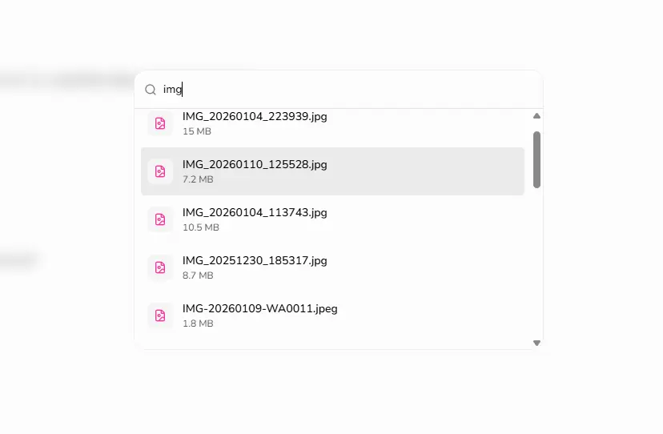
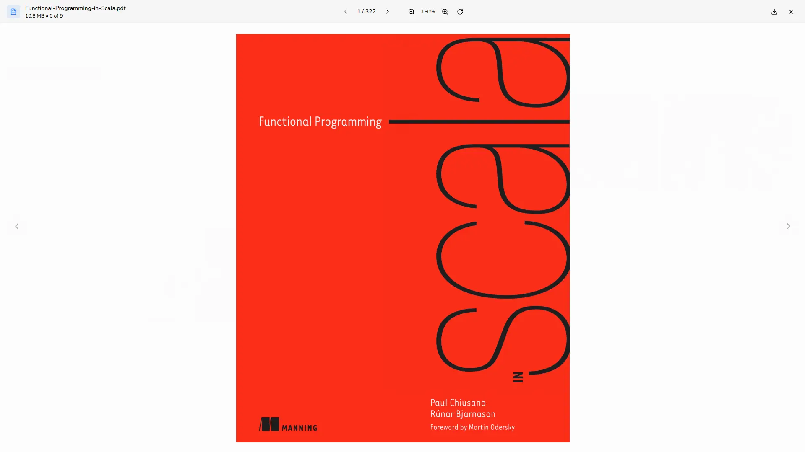
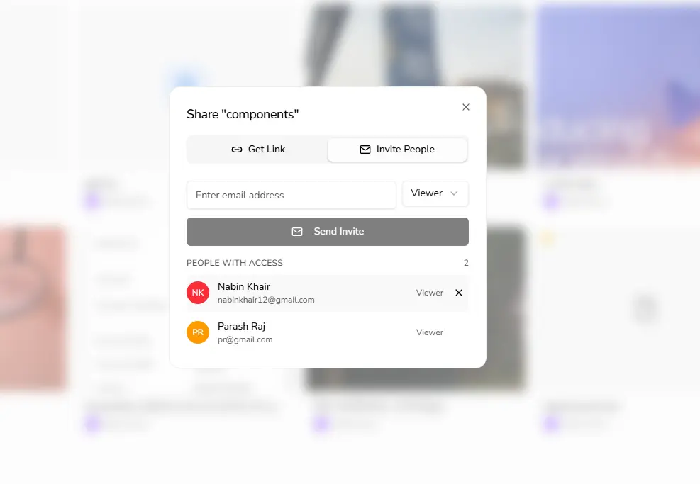

# Assets Man

**Your files, your cloud.**

A self-hosted, open-source Google Drive alternative.

---

  <picture>
    <source media="(prefers-color-scheme: dark)" srcset="apps/web/public/marketing/files-dark.webp">
    
  </picture>

## About

Assets Man is a privacy-first, self-hosted file management platform built for individuals and teams who want full control over their data. Bring your own S3-compatible storage backend and run it on your own infrastructure -- no third-party cloud required.

## Features

| Feature | Description |
|---|---|
| **File Management** | Upload, organize, star, trash, and bulk download files |
| **Folder Hierarchy** | Nested folders with full directory navigation |
| **Instant Search** | Fast full-text search across all your files |
| **Rich Previews** | Images, PDFs, code with syntax highlighting, and videos |
| **Secure Sharing** | User shares, public links, password protection, and expiry dates |
| **Storage Quotas** | Configurable per-user quotas (5 GB default) |
| **Thumbnail Generation** | Auto-generated thumbnails for images, videos, and PDFs |
| **OTP Registration** | Email-verified signup with one-time password flow |
| **Dark Mode** | Full dark mode support across the UI |
| **Responsive Design** | Works on desktop, tablet, and mobile |

## Screenshots

  <table>
    <tr>
      <td>
        <picture>
          <source media="(prefers-color-scheme: dark)" srcset="apps/web/public/marketing/search-dark.webp">
          
        </picture>
      </td>
      <td>
        <picture>
          <source media="(prefers-color-scheme: dark)" srcset="apps/web/public/marketing/pdf-preview-dark.webp">
          
        </picture>
      </td>
      <td>
        <picture>
          <source media="(prefers-color-scheme: dark)" srcset="apps/web/public/marketing/share-assets-dark.webp">
          
        </picture>
      </td>
    </tr>
    <tr>
      <td align="center"><strong>Instant Search</strong></td>
      <td align="center"><strong>Rich Previews</strong></td>
      <td align="center"><strong>Secure Sharing</strong></td>
    </tr>
  </table>

## Tech Stack

**Frontend:** Next.js, React, Tailwind CSS, Radix UI, TanStack Query

**Backend:** Express, Drizzle ORM, PostgreSQL

**Storage:** AWS S3 / Google Cloud Storage / S3-compatible (MinIO, Cloudflare R2)

**Email:** Resend

**Monorepo:** pnpm, Turborepo

## Contributing

Contributions are welcome! If you'd like to help improve Assets Man, feel free to open an issue or submit a pull request. Check the [open issues](https://github.com/nabinkhair42/assets-man/issues) for ideas on where to start.

## Stargazers over time

## License

This project is licensed under the [ISC License](https://opensource.org/licenses/ISC).
